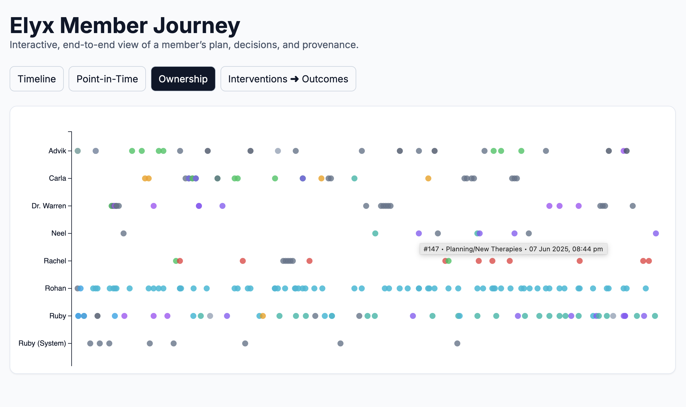

# Med Data Generation

A discrete-event simulation that models a personalized medical support program for a client. The project combines deterministic processes with stochastic events and large language model (LLM) agents to produce synthetic conversations, interventions and health data.

## Features

- **SimPy-based timeline** for scheduling onboarding, interventions and follow-up events.
- **LLM-driven agents** that respond with role‑specific personas and generate member questions.
- **Semantic router** to choose the appropriate expert for each member question.
- **Configurable stochastic processes** for plan adherence, travel and health issues.
- **Structured event logging** saved to `simulation_log.json` for downstream analysis.

## Communication Message Generation Methodology

1. SimPy-driven timeline
   - The simulation starts from a configured date and runs for eight months, modeling Rohan's journey.
   - Deterministic and stochastic processes (diagnostic tests, exercise updates, travel, health issues, milestones) are scheduled to mirror real-world interactions.
2. Agent personas and LLM responses
   - Member and Elyx expert personas are defined with distinct roles and voices.
   - When questions arise or proactive check-ins are due, context is distilled from recent events and fed to LLM-backed agents to craft WhatsApp-style messages.
   - DSPy orchestrates these interactions, supplying structured prompts and handling multi-step reasoning.
   - The LLM layer is pluggable: the configuration can route requests to local open-source models such as Gemma 3 via LM Studio or to hosted APIs like Google Gemini or OpenAI.
3. Event logging and chat log creation
   - Every message and key state change is logged with a timestamp.
   - At the end of the run, the log is distilled into a readable chat transcript for further analysis.

## Member Journey Visualization Methodology (process_chat.py)

1. Parse simulation outputs
   - Load the structured event log and chat transcript produced by the simulation.
   - Organize messages by day, tagging them by source and topic (plan updates, lab results, travel, etc.).
2. Aggregate state data
   - Combine communication records with wearable metrics, lab markers, and adherence flags stored in the event log to build a day-by-day profile of the member.
3. Generate visual summaries
   - Produce timelines and snapshot views showing conversation volume, key interventions, and health metrics.
   - Enable queries for specific dates to understand the member's context and progress at that moment.

Here’s what the visulaisation looks like:




## Repository Structure

| Path          | Purpose                                                             |
| ------------- | ------------------------------------------------------------------- |
| `config.py`   | Simulation parameters, agent personas and LLM toggle.               |
| `agents/`     | DSPy modules implementing expert, member and routing agents.        |
| `models/`     | Pydantic models describing the simulation state.                    |
| `simulation/` | Processes that drive the timeline and probabilistic events.         |
| `utils.py`    | Logging helpers and context distillation for the LLM.               |
| `main.py`     | Entry point that wires everything together and runs the simulation. |

## Getting Started

1. **Install Dependencies**

   ```bash
   pip install -e .
   ```

2. **Set Environment Variables**

   The project uses Google Gemini through DSPy. Export your API key before running the simulation:

   ```bash
   export GOOGLE_API_KEY="your-key"
   ```

3. **Run the Simulation**

   ```bash
   python main.py
   ```

   Events are printed to the console and persisted to `simulation_log.json`.

## Configuration

Edit `config.py` to customize the run:

- `LLM_ENABLED` toggles between a pure SimPy simulation and one that calls the LLM agents.
- `SIMULATION_DURATION_DAYS` controls how long the environment runs.
- `AVG_DAYS_PER_MEMBER_QUESTION`, `PLAN_ADHERENCE_PROBABILITY` and other constants tune stochastic behavior.
- `MEMBER_PROFILE` and `AGENT_PERSONAS` define the personalities used by the agents.
